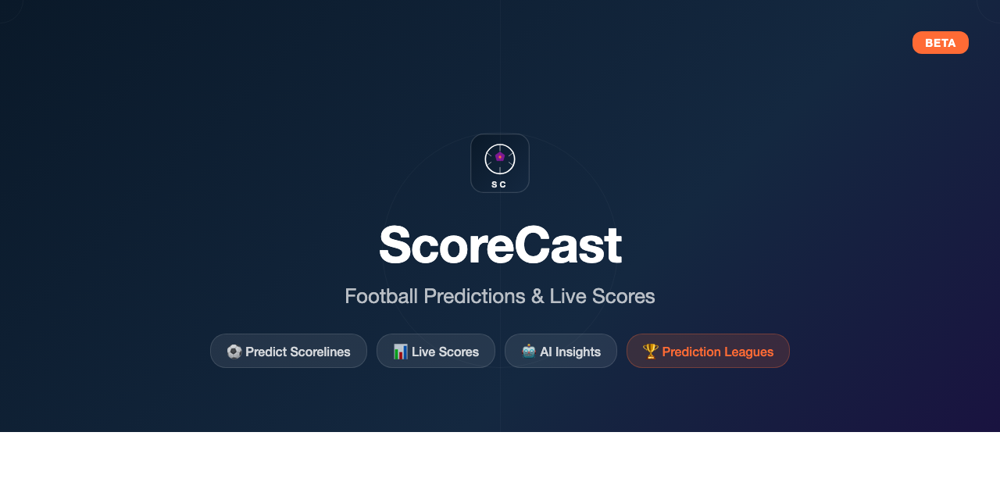

# ScoreCast

<p align="center">
  
</p>

**🏆 Predict. Compete. Prove You Know Football.**

ScoreCast is a free football prediction game where you predict exact scorelines, compete with friends in private leagues, and track every match with live scores and AI-powered insights. No money, no gambling — just bragging rights.

🌐 **Live at [www.scorecast.uk](https://www.scorecast.uk)**

> **⚠️ ScoreCast is NOT a betting or gambling site.** This is a free prediction game played purely for fun and bragging rights. There is no real money involved — no stakes, no wagers, no payouts. We do not facilitate, encourage, support, or endorse gambling or betting in any form. Terms like "risk plays" and "bonus points" refer only to in-game scoring mechanics with zero monetary value.

## Key Features

- **Score Predictions** — Predict exact scorelines for every match. Earn points for correct results, bonus for exact scores.
- **Risk Plays** — Optional side bets per gameweek (Double Down, Exact Score Boost, Clean Sheet, First Goal Team, Over/Under) for bonus points or penalties. No real money.
- **Private Leagues** — Create a league, share the invite code, compete head-to-head across the season.
- **Player Profiles** — View league members' prediction history, stats, and risk play results.
- **Live Scores** — Real-time match updates with goals, cards, substitutions, and minute-by-minute tracking.
- **AI Insights** — AI-generated match previews with form analysis and predicted outcomes.
- **Tables & Stats** — League tables, player stats, top scorers, form guides.
- **Team Profiles** — Squads, recent results, upcoming fixtures, competition history.

## Supported Competitions

- 🏴󠁧󠁢󠁥󠁮󠁧󠁿 **Premier League** — Full 38-matchweek season
- 🌍 **FIFA World Cup 2026** — Groups + knockout bracket
- More on the roadmap

## Tech Stack

- **.NET 10** (SDK 10.0.101) with latest C# features
- **FastEndpoints 8.0.1** — REPR pattern, CQRS without MediatR
- **Entity Framework Core 10.0.4** with **Npgsql** (Neon PostgreSQL)
- **Firebase Auth** — Email/Password + Google Sign-In
- **Blazor WASM** (standalone) with **MudBlazor 9.1.0**
- **Refit 10.0.1** — typed HTTP API clients
- **FluentValidation** — form validation with MudBlazor bridge
- **Serilog** — structured logging (console + rolling file)
- Central Package Management, `.slnx` solution format

## Hosting

| Service | Platform |
|---|---|
| Frontend | Cloudflare Pages |
| API | Render |
| Database | Neon PostgreSQL |
| Auth | Firebase (Google Cloud) |
| Sync Jobs | GitHub Actions (scheduled cron) |

## Scoring

| Outcome | Points |
|---|---|
| Exact Scoreline | 10 |
| Correct Result + Goal Difference | 7 |
| Correct Result | 5 |
| Correct Goal Difference | 3 |
| Incorrect | 0 |

### Risk Plays (optional per gameweek)

| Type | Won | Lost |
|---|---|---|
| Double Down | +base points again | -5 |
| Exact Score Boost | +15 | -5 |
| Clean Sheet Bet | +5 | -3 |
| First Goal Team | +3 | -2 |
| Over/Under 2.5 | +3 | -2 |

## Projects

### APIs
| Project | Purpose |
|---|---|
| **ScoreCast.Ws** | API host, DI, middleware, startup |
| **ScoreCast.Ws.Application** | Commands, queries, interfaces |
| **ScoreCast.Ws.Domain** | Entities, value objects |
| **ScoreCast.Ws.Endpoints** | FastEndpoints definitions, preprocessors |
| **ScoreCast.Ws.Infrastructure** | Handlers, DbContext, entity configs, external APIs |
| **ScoreCast.Ws.Services** | Cross-cutting business services |

### Web
| Project | Purpose |
|---|---|
| **ScoreCast.Web** | Blazor WASM app (pages, layout, theme, auth) |
| **ScoreCast.Web.Server** | ASP.NET Core host for WASM |
| **ScoreCast.Web.Components** | Razor class library (reusable components, helpers) |

### Shared
| Project | Purpose |
|---|---|
| **ScoreCast.ApiClient** | Refit API interfaces |
| **ScoreCast.Models** | Request/response records |
| **ScoreCast.Shared** | Constants, enums, extensions, types |

## Architecture

```
Ws (host) → Endpoints → Application → Domain → Shared
                ↑              ↑
            Services     Infrastructure → Application → Domain
                                ↓
                          Shared libs

Web.Server → Web (WASM) → Web.Components → Models, ApiClient
```

## Data Sync

Match data flows through two stages:

1. **Sync Matches** — historical data sync that pulls fixtures, kickoff times, and final scores from external APIs. Runs every 6 hours to pick up schedule changes, postponements, and results for matches that finished outside live hours.

2. **Enhance Live** — during match hours (12-23 UTC), polls the Pulse API every 2 minutes for real-time scores, match minute, and events (goals, cards, subs) for any match not yet marked as finished.

After scores are in, two follow-up jobs run every 10 minutes during match hours:
- **Calculate Points** — computes prediction outcomes and resolves risk plays for finished matches
- **Update Matchday** — advances the current gameweek per season

| Workflow | Schedule | What it does |
|---|---|---|
| `sync-matches.yml` | Every 6 hours | Fixtures, scores, statuses from Pulse/football-data.org |
| `enhance-live.yml` | Every 2 min (12-23 UTC) | Live scores, match events, minute-by-minute updates |
| `calculate-points.yml` | Every 10 min (12-23 UTC) | Prediction outcomes + risk play resolution |
| `update-matchday.yml` | Every 10 min (12-23 UTC) | Current gameweek per season |
| `generate-insights.yml` | Daily 6 AM UTC | AI match previews for upcoming fixtures |

Manual sync also available via admin page (`/master-data-sync`).

## Data Sources

| Source | Usage |
|---|---|
| **Pulse API** | Primary for Premier League (fixtures, scores, events, teams, lineups) |
| **Football-data.org** | Fallback for non-PL or when Pulse fails |
| **FPL API** | Player data enrichment, Pulse ID mappings |

## Authentication

- **Frontend**: Firebase JS SDK via interop. `ScoreCastAuthStateProvider` manages auth state. `FirebaseTokenHandler` attaches ID tokens to API requests. Persistent login via IndexedDB.
- **Backend**: Firebase JWT validation (`securetoken.google.com/{projectId}`). `FirebaseUserPreprocessor` extracts user identity and populates `ScoreCastRequest.UserId`.
- **API Key Auth**: For GitHub Actions sync jobs. `ApiKeyAuthHandler` validates `X-Api-Key` header. Sets `UserId` to client name (e.g., `ScoreCast.Jobs`).
- Firebase API key is public (client-side) — this is by design.

## Running Locally

### Prerequisites
- .NET 10 SDK

### 1. Configure user secrets
```bash
cd src/APIs/ScoreCast.Ws
dotnet user-secrets set "ConnectionStrings:ScoreCastDb" "<neon-connection-string>"
dotnet user-secrets set "Firebase:ProjectId" "<firebase-project-id>"
dotnet user-secrets set "ApiKeySettings:Clients:0:Key" "<api-key>"
dotnet user-secrets set "AI:GitHubToken" "<github-token>"
dotnet user-secrets set "ApiSettings:FootballDataApi:ApiKey" "<football-data-api-key>"
```

### 2. Run the app
Run both projects:
- **ScoreCast.Ws** → API on port 5105
- **ScoreCast.Web.Server** → Blazor WASM on port 5200

> Do NOT run `ScoreCast.Web` directly — there's a .NET 10.0.101 WasmAppHost bug.

## Git Workflow

- Feature branches → squash merge PRs → delete branch
- `cloudfare-dev` synced via `git merge master` for Cloudflare Pages deployment
- Branch naming: `feat/xxx`, `fix/xxx`, `chore/xxx`

## Background Services

| Service | Interval | Purpose |
|---|---|---|
| `EnhanceLiveMatchesBackgroundService` | 30s | Calls enhance-live endpoint via loopback HTTP for real-time scores |
| `CacheHighlightsBackgroundService` | Hourly | Scrapes YouTube for goal clips and full highlights |
| `CleanupHighlightsBackgroundService` | 2 hours | Checks all highlights via oEmbed, soft-deletes unavailable videos |

## Email

Welcome emails sent via Gmail SMTP from `nitesh@scorecast.uk` on new user signup. Cloudflare Email Routing handles inbound, Gmail "Send mail as" handles outbound. Password reset emails handled by Firebase.

## Onboarding

6-step carousel on first login: Welcome → Predict & Score → Leagues & Community → Install Guide → Display Name (with profanity filter) → Favourite Team. State persisted via `has_completed_onboarding` column — re-shows if closed mid-flow.

## Content Moderation

- **Display names**: Profanity filter with 2,487-word blocklist + allowlist for legitimate names (Dickens, Hancock, Arsenal, etc.)
- **League names**: Same profanity check on creation
- **YouTube highlights**: Ad keyword filter blocks betting/sponsor/promo content from being cached
